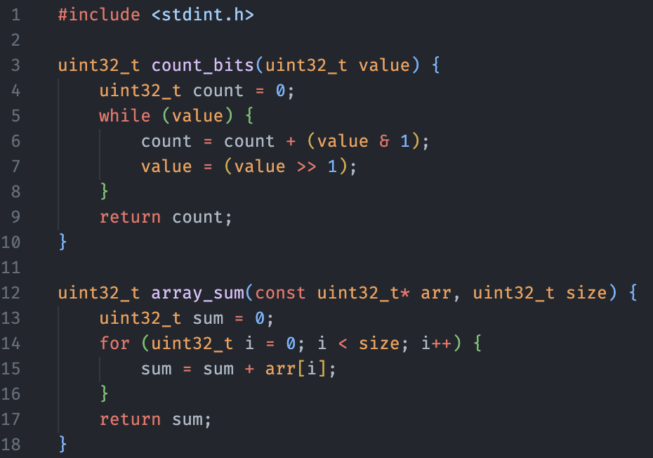
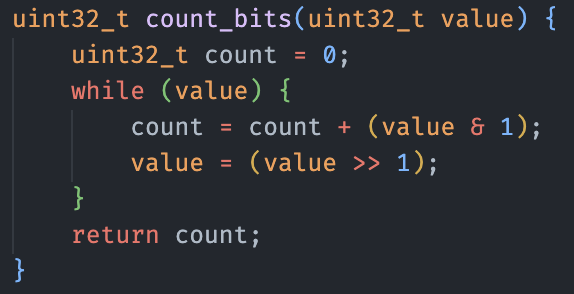
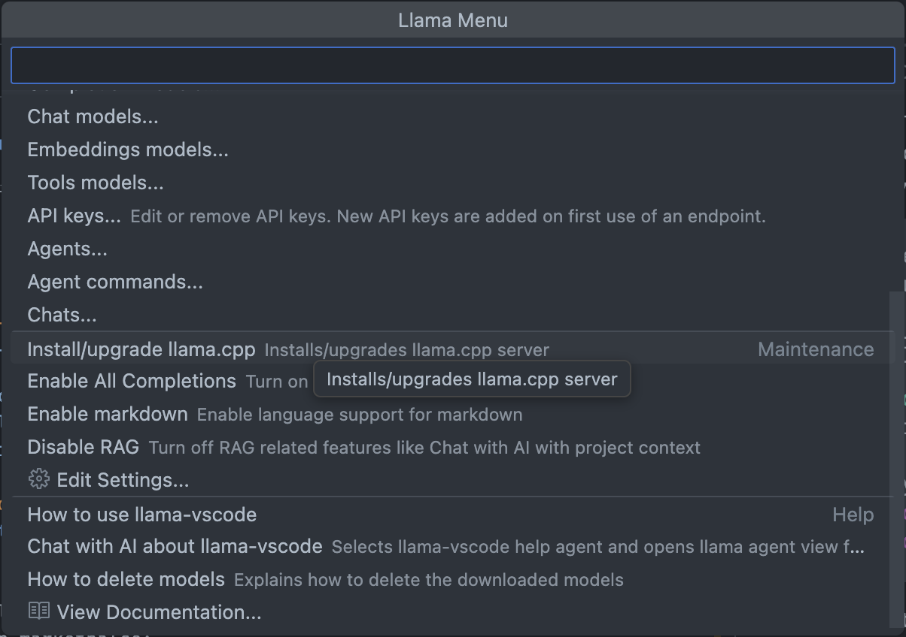

# Code LoRA Finetuner

Create your own local code autocomplete model, fine-tuned on your custom code repository, for use in editors like VS Code or Neovim.

Fine-tuning is achieved by training a Low-Rank Adapter [LoRA](https://arxiv.org/abs/2106.09685) to perform Fill-In-the-Middle ([FIM](https://arxiv.org/abs/2207.14255)) completion. 

## Project Structure
```
.
├── src/                 # Source code
├── scripts/             # Utility scripts
├── tests/               # Unit tests 
├── third_party/         # External submodules
├── config/              # Configuration files
├── docs/                # Documentation
├── data/                # Data
├── lora_adapter/        # LoRA adapter
├── lora_model/          # LoRA model
├── lora_model_gguf/     # LoRA model in gguf format
└── results/             # Evaluation outputs
```

## How Training Examples Are Created
To generate high-quality FIM examples, the system extracts high-level structural code blocks (e.g., functions, classes). From these blocks, logical sub-blocks (e.g., statements, expressions) are masked to serve as the "middle" section for the model to predict.

Here is an example illustrating how a single FIM example is created:
<table>
  <tr>
    <td align="center" valign="top">
      <strong>Source Code File</strong><br>
      
    </td>
    <td align="center" valign="top">
      <strong>Code Block</strong><br>
      
    </td>
    <td align="center" valign="top">
      <strong>One Subblock</strong><br>
      
    </td>
  </tr>
</table>


```python
<|fim_prefix|>uint32_t count_bits(uint32_t value){\n  uint32_t count = 0;\n  while(value){\n    
<|fim_suffix|>    }\n    return count;
<|fim_middle|>count = count + (value & 1);\n    value = (value >> 1);
```

Using this technique, rather than randomly splitting code into unrelated text chunks, helps the model learn the logical patterns and structure of your specific codebase, dramatically improving output quality.

## Installation
### Using uv:
```bash
# Clone the repo
git clone --recurse-submodules https://github.com/cuolm/code-lora-finetuner
cd code-lora-finetuner

# Create a virtual environment 
uv venv
source .venv/bin/activate   # Windows: .\.venv\Scripts\activate

# Install dependencies
uv sync
```

### Using pip:
```bash
# Clone the repo
git clone --recurse-submodules https://github.com/cuolm/code-lora-finetuner
cd code-lora-finetuner

# Create a virtual environment 
python3 -m venv .venv
source .venv/bin/activate   # Windows: .\.venv\Scripts\activate

# Install dependencies
pip install -r requirements.txt
```
## Configure and LoRA Fine-tune Model

1.  Place the source code files you want to train on in the `./data` folder.
    * **Auto Split:** Place files directly into `./data`.
    * **Manual Split:** Create `train`, `eval`, and `test` subfolders inside `./data` and manually assign files to them.

2. Make sure that the language of your source code files is listed in the [tree-sitter-language-pack](https://github.com/Goldziher/tree-sitter-language-pack?tab=readme-ov-file#available-languages) library that is used to process the data. If it is not available, go to [this](#build-a-custom-tree-sitter-language-parser) section to build a custom language tree-sitter parser.

    Next, check the `config/language_block_definitions.json` file.
    * **If your language is listed:** Proceed to the next step.
    * **If your language is not listed:** You must add an entry.
      1. Navigate to the [tree-sitter-language-pack](https://github.com/Goldziher/tree-sitter-language-pack?tab=readme-ov-file#available-languages) and find your language's repository link.
      2. Inside the language repository, search the `grammar.js` file for the required syntax node names.
      3. Add a new entry to `config/language_block_definitions.json` for your language, defining the following nodes:
          * `block_types`: The outer syntax nodes (e.g., functions, classes). These are the structural elements from which we create FIM examples.
          * `subblock_types`: The inner syntax nodes (e.g., statements, expressions). These are masked to form the predicted middle portion of the FIM example.


3. Preprocess the raw code files into training, evaluation, and test datasets using the `preprocess_data.py` script. You can change the most important parameters from their default value by using the following flags:

    * `--extensions`: Specifies a list of file extensions to include in the dataset (e.g., `.c`, `.h`, `.cpp`, `.py`). Default is `.c .h`.
    * `--source-files-language`: Specifies the language for tree-sitter parsing (e.g., `c`, `python`, `java`). Default is `c`.  
    **Note:** Ensure this flag matches the programming language of the specified extensions.
    * `--split-mode`: Specifies the dataset splitting mode. Choose `auto` for automatic ratio-based splitting (default) or `manual` if you have created the `train`, `eval`, and `test` subfolders within the raw data path. Default is `auto`.

    You can also use the following flags to override default paths:

    * `--raw-data-path`: Specifies the path to the root directory containing the raw source code files. Overrides the default path `./data`.
    * `--tree-sitter-parser-path`: Specifies the path to a custom compiled tree-sitter parser shared library file (`.so`, `.dylib`, `.dll`). If not set, the parser is tried to be loaded from the [tree-sitter-language-pack](https://github.com/Goldziher/tree-sitter-language-pack?tab=readme-ov-file#available-languages). 


    Example for a C project using auto split and a custom parser, executed at the root of the project:
    ```bash
    python src/preprocess_data.py \
        --extensions .c .h \
        --source-files-language c \
        --split-mode auto \
        --raw-data-path "$PWD/data/data_c" \
        --tree-sitter-parser-path "$PWD/third_party/tree-sitter-c/libtree-sitter-c.dylib"
    ```

4.  Fine-tune the model using `finetune_model.py`.
    Parameters can be changed in the `Config` dataclass at the top of the file if needed:
    ```bash
    python src/finetune_model.py
    ```
    **Note:**
    * Resume training from a specific checkpoint by using `--resume="checkpoint-name"`.
    * Use `--resume="last"` to continue from the most recent checkpoint in the `./results` directory.

5.  Evaluate the finetuned model and compare its performance to the base model using `evaluate_model.py`:
    ```bash
    python src/evaluate_model.py
    ```
**Complete Example**: Fine-tuning on [Zephyr](https://github.com/zephyrproject-rtos/zephyr) kernel with all parameters, loss plots, evaluation results, and generation output: [see here](docs/finetuner_example/finetuner-example.md)

**Note:** There is also a bash script in the project root that automates the entire pipeline:
```bash
./run_pipeline.sh
```

## How to Use The LoRA Finetuned Model
You can use the fine-tuned model with any code autocompletion tool that supports FIM autocomplete models.
This section shows how to use the VS Code extension [llama.vscode](https://github.com/ggml-org/llama.vscode) to run the model fully locally on your machine.
1. Convert the fine-tuned model to GGUF format.  
Clone the [llama.cpp](https://github.com/ggml-org/llama.cpp) repository to your local machine. Adjust the project_root_path variable to the path where you cloned this project's repository (code-lora-finetuner).
    ```bash
    # IMPORTANT: Change this path to the actual root directory of this project!
    project_root_path="/path/to/your/code-lora-finetuner" 

    git clone https://github.com/ggml-org/llama.cpp
    cd llama.cpp
    pip install -r requirements.txt

    python convert_hf_to_gguf.py \
        "$project_root_path/lora_model" \
        --outfile "$project_root_path/lora_model_gguf" \
        --outtype bf16
    ```

2. Install the llama.vscode extension from the VS Code Marketplace:
[click here](https://marketplace.visualstudio.com/items?itemName=ggml-org.llama-vscode)

3. Ensure llama.cpp is installed.
    Show the llama-vscode menu by clicking llama-vscode in the status bar or pressing Ctrl+Shift+M, then select "Install/Upgrade" llama.cpp.
    

    Alternatively you can also install llama.cpp manually via Homebrew (MacOS)
    ```bash
    brew install llama.cpp
    ```
4. Select the fine-tuned lora_model_gguf as the autocomplete model in llama-vscode:

    In the llama-vscode menu:  
    -> "Completion models..."  
    -> "Add local completion model..."  
    -> Enter model name lora_model_gguf (or any name you prefer).  
    -> Enter the following command to start the model locally:  
    ```bash
     llama-server -m /path/to/your/code-lora-finetuner/lora_model_gguf/lora_model.gguf --port 8012
    ```  
    -> Confirm Endpoint ```http://127.0.0.1:8012```  
    -> No API Key required

    Then, in the llama-vscode menu:  
    ->"Completion models..."  
    ->"Select/Start completion model..."  
    ->"lora_model_gguf"

## Create And Run Docker Image

#### 1. Build the Docker Image
Build the image from the `Dockerfile`, tagging it as codelora-image.
```bash
docker build -t codelora-image .
```
#### 2. Prepare Data and Run the Container
To allow the container to access your source code for fine-tuning, use a bind mount to link your host machine's `data` directory to the container.
- Create the `data` directory: On your host machine (where you run Docker), create a folder named `data` if it doesn't already exist.
- Place source code: Put all source code or folders you want to use for fine-tuning inside the `data` directory.
- Run an interactive container shell: Start the container with the bind mount, and open a Bash shell:

```bash
docker run -it --rm -v $(pwd)/data:/app/data codelora-image /bin/bash
```
Within the container, navigate the file system and edit scripts with vim to adjust any paths or code as necessary.

## Build a Custom Tree-sitter Language Parser

If the language you want to use for fine-tuning is not present in the [Tree-sitter Language Pack](https://github.com/Goldziher/tree-sitter-language-pack), you can build a tree-sitter language parser from source. Here is an example for the Mojo programming language:

#### 1. Add as Submodule and Build

Add the Tree-sitter language repository to the `third_party` directory as a submodule.

```bash
git submodule add https://github.com/lsh/tree-sitter-mojo.git third_party/tree-sitter-mojo     

cd tree-sitter-mojo

make
```
After executing these instructions, you should have a shared library file named libtree-sitter-mojo.so (Linux), libtree-sitter-mojo.dylib (macOS), or libtree-sitter-mojo.dll (Windows) in the root directory of the `tree-sitter-mojo` repository.

#### 2. Ensure Language Blocks Are Defined
Go to `config/language_block_definitions.json` and verify that the language you want to fine-tune the model on is listed. If it is not, navigate to the language repository you cloned earlier at third_party/tree-sitter-mojo and search the `grammar.js` file for the block definition names. Then, add an entry in the `config/language_block_definitions.json` file for your specific language—in this example, "mojo."
`block_types` define the outer syntax nodes representing high-level structural elements such as functions, classes, and structs. These are the code segments from which we extract chunks to create FIM examples.
`subblock_types` define the inner syntax nodes like statements, expressions, and declarations. These nodes are randomly selected and masked to form the middle portion of the FIM example, which the model is trained to predict.
```json
  "mojo": {
    "block_types": [
      "function_definition",
      "struct_definition",
      "trait_definition",
      "class_definition",
      "enum_definition"
    ],
    "subblock_types": [
      "compound_statement",
      "parameter_list",
      "declaration",
      "expression_statement",
      "return_statement",
      "assignment",
      "augmented_assignment",
      "try_statement",
      "catch_clause",
      "finally_clause",
      "decorated_definition"
    ]
  }
```
#### 3. Preprocess Data
Preprocess your data by setting the `--tree-sitter-parser-path` to the tree-sitter parser library file you have just created.

Example executed from the root directory of the project:
```bash
python src/preprocess_data.py \
    --extensions .mojo \
    --source-files-language mojo \
    --split-mode auto \
    --raw-data-path "$PWD/data" \
    --tree-sitter-parser-path "$PWD/third_party/tree-sitter-mojo/libtree-sitter-mojo.dylib"
```

## Tests
Pytest suite covering core functionality. Uses data in `tests/test_data/`.  
**Run all tests:**
```bash
pytest
```
**Run a single test example:**
```bash
pytest test_preprocess.py::test_tokenize_examples -s -v
```
**Note:** First run downloads model to cache if no LoRA model was finetuned before. (~300MB)

## Useful Resources
- [Qwen2.5-Coder Technical Report](https://arxiv.org/pdf/2409.12186)
- [Structure-Aware Fill-in-the-Middle Pretraining for Code](https://arxiv.org/pdf/2506.00204)
- [LORA: LOW-RANK ADAPTATION OF LARGE LANGUAGE MODELS](https://arxiv.org/pdf/2106.09685)
- [Efficient Training of Language Models to
Fill in the Middle](https://arxiv.org/pdf/2207.14255)
- [HF LLM Course](https://huggingface.co/learn/llm-course/chapter1/1)
- [llama.vscode](https://github.com/ggml-org/llama.vscode)

## License

This project is licensed under the [Apache License 2.0](LICENSE.txt).
