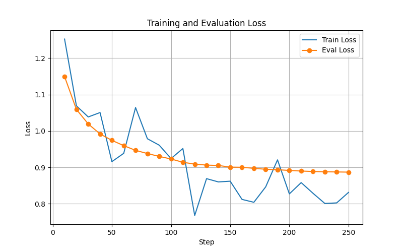
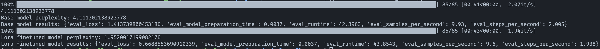
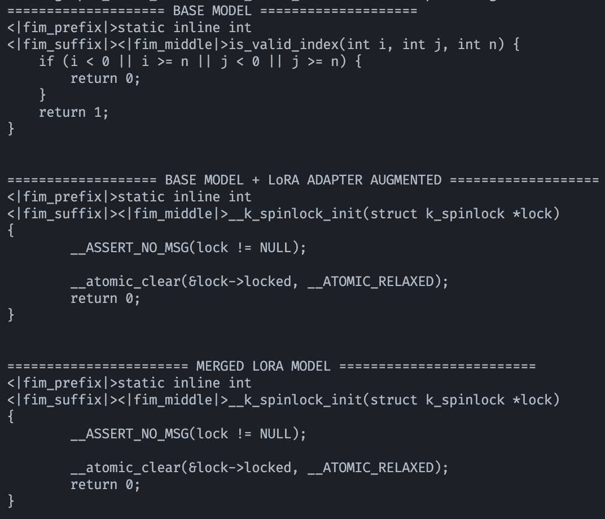

## Example: Fine-tuning on the [Zephyr](https://github.com/zephyrproject-rtos/zephyr) kernel code

This example shows how to fine-tune a Qwen2.5-Coder-1.5B model using LoRA on the Zephyr kernel code, with an NVIDIA L4 GPU on a Google Cloud VM (GCE). For setup assistance, refer to the [installation guide](install-nvidia-l4-driver.md) for NVIDIA L4 driver on Debian 11.

### Configuration Parameters

#### Preprocessing
| Parameter | Value |
|------------|----------|
| `model_name` | `"Qwen/Qwen2.5-Coder-1.5B"` |
| `byte_per_token_ratio` | 3 |
| `bytes_per_code_block` | `500 * byte_per_token_ratio` |
| `train_ratio` | 0.8 |
| `eval_ratio` | 0.1 |
| `test_ratio` | 0.1 |
| `rng_seed` | 0 |
| `source_files_language` | `"c"` |
| `extensions` | `[".c", ".h"]` |

#### Fine-tuning
| Parameter | Value |
|------------|----------|
| `model_name` | `"Qwen/Qwen2.5-Coder-1.5B"` |
| `lora_r` | 32 |
| `lora_alpha` | 64 |
| `lora_dropout` | 0.1 |
| `trainer_num_train_epochs` | 1 |
| `trainer_per_device_train_batch_size` | 8 |
| `trainer_gradient_accumulation_steps` | 4 |
| `trainer_learning_rate` | 2e-5 |
| `trainer_eval_steps` | 10 |
| `trainer_save_steps` | 10 |

---

### Fine-tuning 


#### 1. Clone Repository
```bash
# Ensure you are in the project root before running
git clone https://github.com/zephyrproject-rtos/zephyr.git data/zephyr
```

#### 2. Preprocess Data
```bash
python src/preprocess_data.py \
    --extensions .c .h \
    --source-files-language c \
    --split-mode auto \
    --raw-data-path "$PWD/data/zephyr/kernel"
```
#### 3. Fine-tune Model
```bash
python src/finetune_model.py
```
This is the training and evaluation loss plot obtained:


### Evaluation
#### 1. Run Evaluation
Evaluate the fine-tuned against the base model on the test dataset with the evaluation script.

```bash
python src/evaluate_model.py
```
and we get this output:


- **Loss** shows how much the model’s predicted FIM middle tokens differ from the correct FIM middle tokens in the test dataset.
- **Perplexity** (=exp(loss)) reflects how confident the model is in its FIM middle token predictions, smaller numbers mean the model is more certain when predicting the middle tokens. A value of 1 represents perfect prediction where the model is always certain.

In this evaluation, the base model had a perplexity of **4.11**, while the LoRA fine-tuned model achieved **1.95**, meaning it became roughly twice as confident and accurate when predicting the missing middle section of the FIM examples in the test dataset.

#### 2. Generate 
Test if the model learned Zephyr kernel-specific C coding style by generating completions.
First change the prefix and suffix in the script to write a simple function:
```bash
    prefix_c = textwrap.dedent("""\
    static inline int 
    """)
    suffix_c = textwrap.dedent("""\
    """)
```
Run the generation script:
```bash
python scripts/generate_from_model.py
```
and get this output:



#### 3. Conclusion
The fine-tuned model produces Zephyr kernel-specific patterns (naming conventions, structure) whereas the base model simply produces generic C code.
